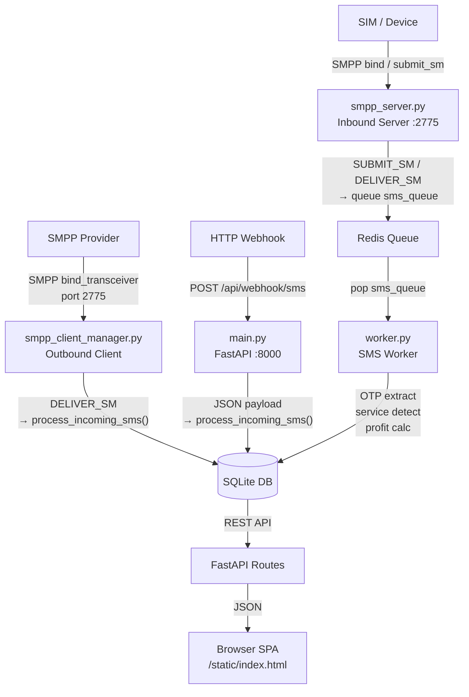
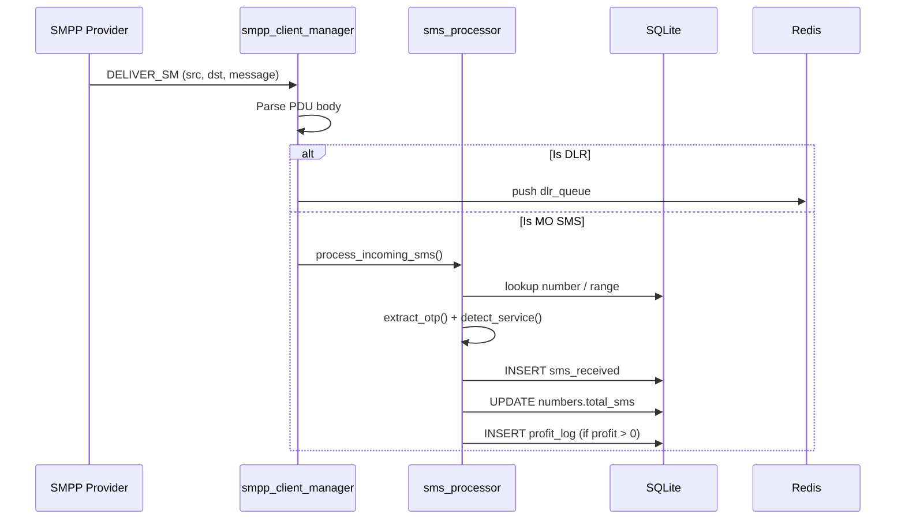
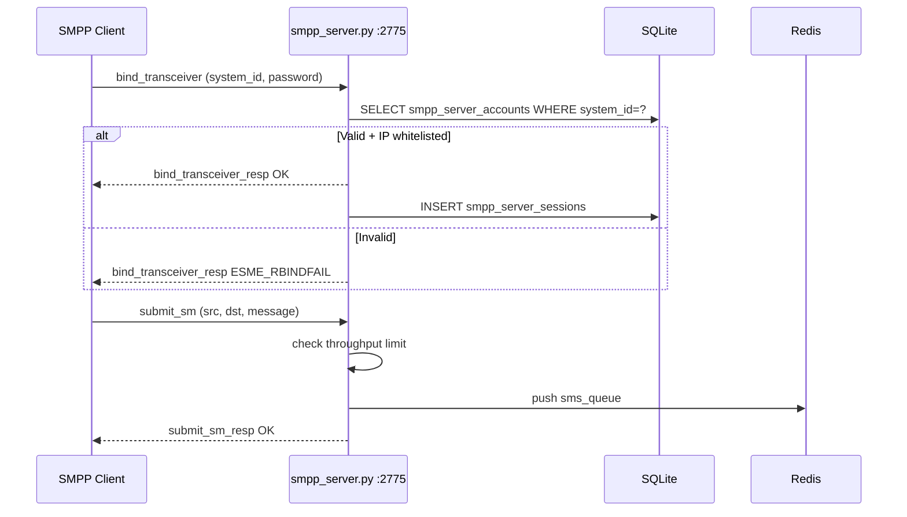
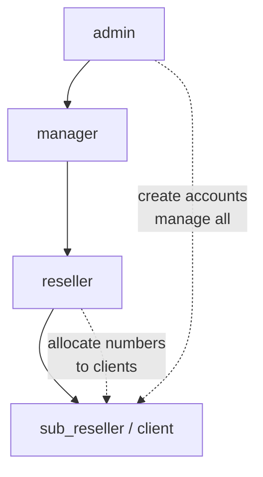

# SIGMAPANEL

SMS OTP Management Platform — receives SMS from SMPP providers, extracts OTPs, manages numbers/ranges/users, and exposes a full REST API + live web dashboard.

---

## Architecture Overview



---

## SMS Receive Flow



---

## SMPP Server (Inbound) Flow



---

## User / Role Hierarchy



---

## Quick Start — Local Installation

### Requirements

- Python 3.11+
- Redis (`sudo apt install redis-server`)
- Git

### 1 — Clone & install

```bash
git clone https://github.com/Adnan5740/sigmapanel-ci.git
cd sigmapanel-ci
python3 -m venv venv
source venv/bin/activate
pip install -r requirements.txt
```

### 2 — Start Redis

```bash
sudo systemctl start redis-server
# or: redis-server --daemonize yes
```

### 3 — Run (dev / one-shot)

```bash
bash entrypoint.sh
```

Ports opened:
| Service | Port |
|---|---|
| Web dashboard + API | `8000` |
| SMPP server (inbound) | `2775` |

Default login: `admin` / `admin123`

---

## ⚠️ Keep the Site Alive After SSH Disconnect

When you close your SSH session the process dies because it's attached to your terminal.  
**Fix: run as a systemd service** (recommended) or use `nohup`/`tmux` as a quick alternative.

---

### Option A — systemd service (recommended, survives reboot)

```bash
# 1. Copy files
sudo cp -r . /var/www/sigmapanel
sudo python3 -m venv /var/www/sigmapanel/venv
sudo /var/www/sigmapanel/venv/bin/pip install -r /var/www/sigmapanel/requirements.txt

# 2. Install the service
sudo cp /var/www/sigmapanel/sigmapanel.service /etc/systemd/system/sigmapanel.service

# 3. Edit paths if needed
sudo nano /etc/systemd/system/sigmapanel.service

# 4. Enable & start
sudo systemctl daemon-reload
sudo systemctl enable sigmapanel
sudo systemctl start sigmapanel

# 5. Check status
sudo systemctl status sigmapanel
sudo journalctl -u sigmapanel -f   # live logs
```

`sigmapanel.service` is already in the repo and configured to `Restart=always`.

---

### Option B — nohup (quick, no reboot persistence)

```bash
nohup bash entrypoint.sh > sigmapanel.log 2>&1 &
echo "PID: $!"
# To stop:  kill <PID>
# Logs:     tail -f sigmapanel.log
```

---

### Option C — tmux (interactive, survives disconnect)

```bash
tmux new-session -d -s sigmapanel 'bash entrypoint.sh'
# Reattach:  tmux attach -t sigmapanel
# Stop:      tmux kill-session -t sigmapanel
```

---

## Docker

```bash
docker build -t sigmapanel .
docker run -d \
  --name sigmapanel \
  -p 8000:8000 \
  -p 2775:2775 \
  -v $(pwd)/data:/app/data \
  sigmapanel
```

Or with docker-compose:

```bash
docker-compose up -d
```

---

## SMPP Provider Setup

### Connect to an external SMPP provider (outbound)

Go to **SMPP SERVER → SMPP Accounts → Create Account → 📡 Provider Connection**

| Field | Example |
|---|---|
| Host / IP | `smpp.provider.com` |
| Port | `2775` |
| System ID | `myclient` |
| Password | `secret` |
| Bind Type | `transceiver` |

The `smpp_client_manager` will connect, bind, and start receiving `DELIVER_SM` messages automatically.

### Create an inbound account (for devices connecting to you)

Go to **SMPP SERVER → SMPP Accounts → Create Account → 👤 Account Setup**

Devices bind to your server on port `2775` using the credentials you create.

---

## HTTP Webhook

Any provider can `POST` to:

```
POST http://<your-ip>:8000/api/webhook/sms
Content-Type: application/json

{
  "to":   "+525529001312",
  "from": "AmericanExpress",
  "msg":  "Your OTP is 847291",
  "uuid": "msg-204953"
}
```

Full webhook URL is shown in **Settings → Webhook Info**.

---

## API Authentication

All API endpoints (except `/health` and `/api/auth/login`) require:

```
Authorization: Bearer <token>
```

Get a token via `POST /api/auth/login` with `{"username":"admin","password":"admin123"}`.

---

## Environment Variables

| Variable | Default | Description |
|---|---|---|
| `DATABASE_URL` | `data/sigmapanel.db` | SQLite path |
| `REDIS_URL` | `redis://localhost:6379/0` | Redis connection |
| `PORT` | `8000` | API port |
| `CORS_ORIGINS` | `*` | Allowed origins |

---

## File Structure

```
sigmapanel-ci/
├── main.py                  # FastAPI app, lifespan, static serving
├── smpp_server.py           # Inbound SMPP server (port 2775)
├── smpp_client_manager.py   # Outbound SMPP client (connects to providers)
├── worker.py                # Background SMS/DLR queue workers
├── sms_processor.py         # Core SMS business logic
├── database.py              # SQLite schema, migrations, seed
├── routes/
│   ├── smpp_interconnect.py # SMPP account & server API
│   ├── providers.py         # HTTP/SMPP provider management
│   ├── sms.py               # SMS query/search API
│   ├── numbers.py           # Number management
│   ├── users.py             # User/role management
│   └── ...
├── static/
│   ├── index.html           # SPA entry point
│   ├── css/style.css        # Design system
│   └── js/                  # Frontend modules
├── sigmapanel.service       # systemd unit file
├── entrypoint.sh            # Start all processes
├── Dockerfile
└── docker-compose.yml
```
