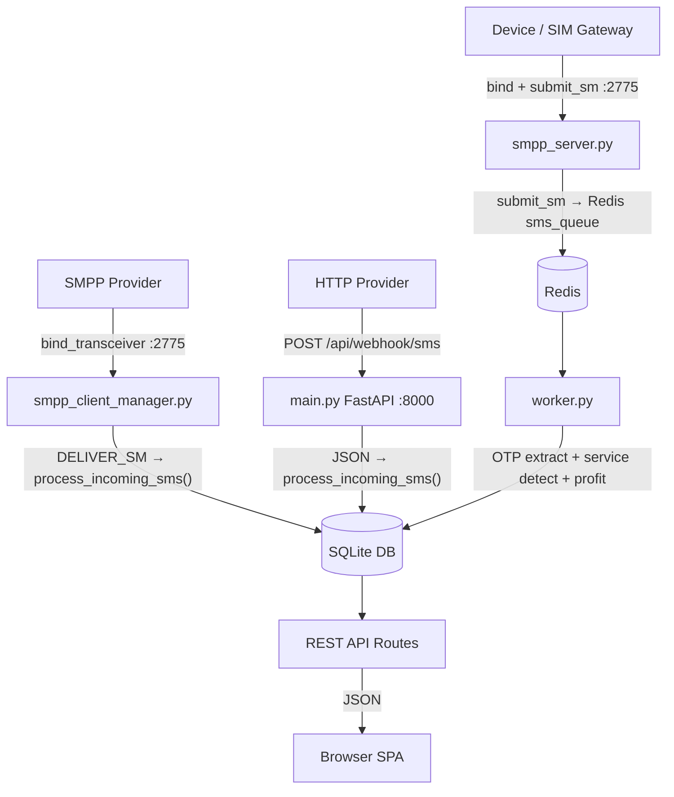
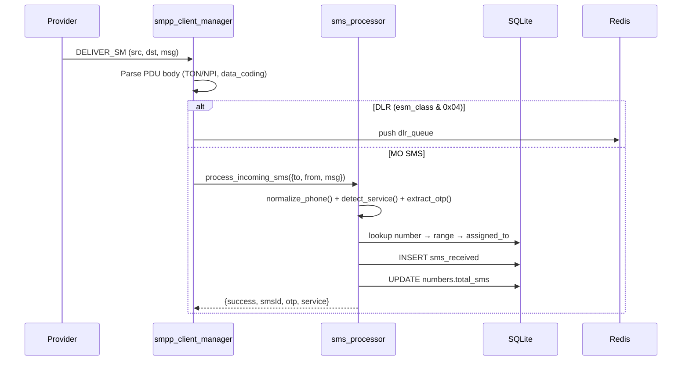
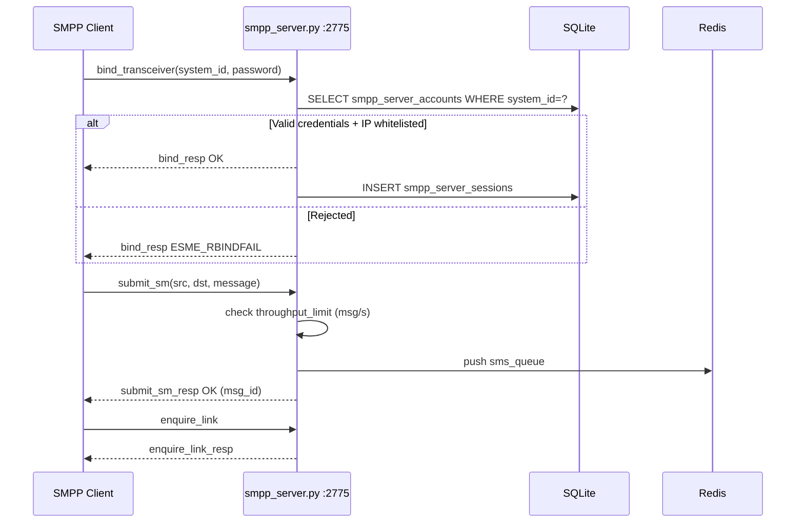
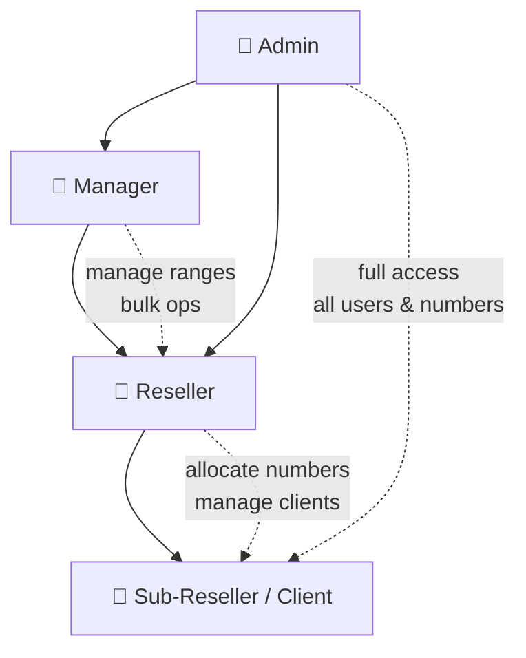

# SIGMAPANEL

Enterprise SMS OTP Management Platform — receives SMS via SMPP and HTTP, extracts OTPs, manages numbers, ranges, users, and exposes a full REST API with a live SPA dashboard.

---

## Table of Contents

- [Architecture](#architecture)
- [SMS Receive Flow](#sms-receive-flow)
- [SMPP Server Flow](#smpp-server-inbound-flow)
- [User Hierarchy](#user--role-hierarchy)
- [File Structure](#file-structure)
- [Quick Start](#quick-start--local)
- [Keep Alive After SSH Disconnect](#-keep-alive-after-ssh-disconnect)
- [Docker](#docker)
- [SMPP Setup](#smpp-setup)
- [HTTP Webhook](#http-webhook)
- [API Authentication](#api-authentication)
- [Environment Variables](#environment-variables)

---

## Architecture



---

## SMS Receive Flow



---

## SMPP Server (Inbound) Flow



---

## User / Role Hierarchy



---

## File Structure

```
sigmapanel-ci/
│
├── main.py                     # FastAPI app — lifespan, middleware, static serving
├── database.py                 # SQLite schema (24 tables), migrations, seed data
├── auth.py                     # JWT auth, password hashing, token helpers
├── audit_utils.py              # Centralized audit log writer
├── sms_processor.py            # Core SMS business logic — limits, profit, OTP
├── otp_extractor.py            # Regex OTP extraction from message body
├── service_detector.py         # Service name detection (sender + message)
├── service_catalog.py          # 7500+ service aliases & canonical names
├── country_detector.py         # Phone number → country detection
├── phone_utils.py              # Phone normalization
├── payout_utils.py             # SMS payout calculation
├── queue_manager.py            # Redis async queue (memory fallback)
├── worker.py                   # Background SMS + DLR queue workers
├── smpp_server.py              # Inbound SMPP server on port 2775
├── smpp_client_manager.py      # Outbound SMPP client — connects to providers
├── security_middleware.py      # IP firewall, rate limiting, brute-force protection
│
├── routes/
│   ├── auth.py                 # POST /api/auth/login, signup, token
│   ├── webhook.py              # POST /api/webhook/sms|receive — HTTP SMS ingest
│   ├── sms.py                  # GET /api/sms — query/search/analytics
│   ├── numbers.py              # CRUD /api/numbers — number management
│   ├── numbers_ext.py          # Allocation, bulk import, export, blacklist
│   ├── ranges.py               # CRUD /api/ranges — SMS range management
│   ├── users.py                # CRUD /api/users — user & role management
│   ├── dashboard.py            # GET /api/dashboard/stats|analytics|recent-sms
│   ├── settings.py             # GET/POST /api/settings, webhook-info, backup
│   ├── providers.py            # CRUD /api/providers — HTTP+SMPP provider config
│   ├── transactions.py         # Balance, ledger, payout requests
│   ├── api_management.py       # API token management
│   ├── notifications.py        # Notifications, news, support tickets
│   ├── profile_notifications.py# User profile + notification preferences
│   ├── smpp_interconnect.py    # SMPP accounts, remote servers, sessions, logs
│   ├── security.py             # Security events, blocked IPs
│   └── deps.py                 # Auth dependency helpers (get_current_user, require_role)
│
├── static/
│   ├── index.html              # SPA entry point — loads all JS/CSS
│   ├── css/
│   │   └── style.css           # Full design system — dark sidebar, cards, badges
│   └── js/
│       ├── ui.js               # UI helpers — modals, toasts, icons (7500+ aliases)
│       ├── api.js              # Authenticated fetch wrapper
│       ├── router.js           # Client-side SPA router
│       ├── app.js              # Nav structure, layout, route wiring
│       ├── auth.js             # Login, signup, session management
│       ├── dashboard.js        # Dashboard stats, charts
│       ├── sms.js              # SMS list, search, live feed
│       ├── numbers.js          # Number management UI
│       ├── ranges.js           # Range management UI
│       ├── users.js            # User management UI
│       ├── smpp.js             # SMPP server accounts UI (tabbed)
│       ├── smpp_interconnect.js# Remote SMPP server connections UI
│       ├── settings.js         # Settings, webhook config, security
│       ├── profile.js          # User profile
│       ├── notifications.js    # Notifications, news, support
│       ├── api_management.js   # API token management UI
│       ├── payouts.js          # Payout requests UI
│       ├── payments.js         # Balance/payments UI
│       ├── security.js         # Security events UI
│       ├── search_access.js    # Number search access
│       └── test_panel.js       # Live SMS test panel
│
├── entrypoint.sh               # Starts all 4 processes (smpp_server, worker, client_mgr, uvicorn)
├── sigmapanel.service          # systemd unit — auto-restart, survives reboot
├── Dockerfile                  # Python 3.11 slim image, exposes 8000 + 2775
├── docker-compose.yml          # app + redis services with proper REDIS_URL
├── requirements.txt            # Python dependencies (pinned versions)
└── README.md                   # This file
```

---

## Quick Start — Local

### Prerequisites

```bash
sudo apt update && sudo apt install -y python3 python3-venv redis-server git
```

### Install

```bash
git clone https://github.com/Adnan5740/sigmapanel-ci.git
cd sigmapanel-ci
python3 -m venv venv
source venv/bin/activate
pip install -r requirements.txt
```

### Start Redis

```bash
sudo systemctl start redis-server
# or: redis-server --daemonize yes
```

### Run

```bash
bash entrypoint.sh
```

| Service | Port |
|---|---|
| Web Dashboard + REST API | `8000` |
| SMPP Server (inbound) | `2775` |

Default credentials: `admin` / `admin123`

---

## ⚠️ Keep Alive After SSH Disconnect

When you close SSH, the process dies because it's attached to your terminal.

### Option A — systemd ✅ Recommended (survives reboot)

```bash
# Copy app files
sudo mkdir -p /var/www/sigmapanel
sudo cp -r . /var/www/sigmapanel
sudo python3 -m venv /var/www/sigmapanel/venv
sudo /var/www/sigmapanel/venv/bin/pip install -r /var/www/sigmapanel/requirements.txt

# Install and enable service
sudo cp /var/www/sigmapanel/sigmapanel.service /etc/systemd/system/
sudo systemctl daemon-reload
sudo systemctl enable sigmapanel
sudo systemctl start sigmapanel

# Check
sudo systemctl status sigmapanel
sudo journalctl -u sigmapanel -f        # live logs
```

### Option B — nohup (survives disconnect, not reboot)

```bash
nohup bash entrypoint.sh > sigmapanel.log 2>&1 &
echo "PID=$!"
# Stop:  kill <PID>
# Logs:  tail -f sigmapanel.log
```

### Option C — tmux

```bash
tmux new-session -d -s sigmapanel 'bash entrypoint.sh'
# Reattach:  tmux attach -t sigmapanel
# Stop:      tmux kill-session -t sigmapanel
```

---

## Docker

```bash
# Build and run
docker-compose up -d

# Logs
docker-compose logs -f app

# Stop
docker-compose down
```

Or without compose:

```bash
docker build -t sigmapanel .
docker run -d \
  --name sigmapanel \
  -p 8000:8000 \
  -p 2775:2775 \
  -e REDIS_URL=redis://host.docker.internal:6379/0 \
  -v $(pwd)/data:/app/data \
  sigmapanel
```

---

## SMPP Setup

### Connect to an External Provider (Outbound)

Navigate to **SMPP SERVER → SMPP Accounts → Create Account → 📡 Provider Connection**

| Field | Example |
|---|---|
| Host / IP | `smpp.provider.com` |
| Port | `2775` |
| System ID | `my_client_id` |
| Password | `secret` |
| Bind Type | `transceiver` |
| Limit | `10` msg/s |

`smpp_client_manager.py` connects automatically and receives `DELIVER_SM` messages.

### Create Inbound Account (Devices connecting to you)

Navigate to **SMPP SERVER → SMPP Accounts → Create Account → 👤 Account Setup**

Clients bind to `<your-ip>:2775` using the credentials you create.

---

## HTTP Webhook

Point your provider to:

```
POST http://<your-server-ip>:8000/api/webhook/sms
Content-Type: application/json
```

```json
{
  "to":   "+525529001312",
  "from": "AmericanExpress",
  "Cli":  "AmericanExpress",
  "msg":  "Your OTP is 847291"
}
```

> `Cli` field is used for service detection — pass the service/brand name here if your provider supports it.

Full webhook URL is shown in **Settings → Webhook Config**.

---

## API Authentication

All endpoints (except `/health` and `/api/auth/login`) require:

```
Authorization: Bearer <token>
```

```bash
curl -X POST http://localhost:8000/api/auth/login \
  -H "Content-Type: application/json" \
  -d '{"username":"admin","password":"admin123"}'
```

---

## Environment Variables

| Variable | Default | Description |
|---|---|---|
| `DATABASE_URL` | `data/sigmapanel.db` | SQLite file path |
| `REDIS_URL` | `redis://localhost:6379/0` | Redis connection string |
| `PORT` | `8000` | HTTP API port |
| `CORS_ORIGINS` | `*` | Allowed CORS origins (comma-separated) |
