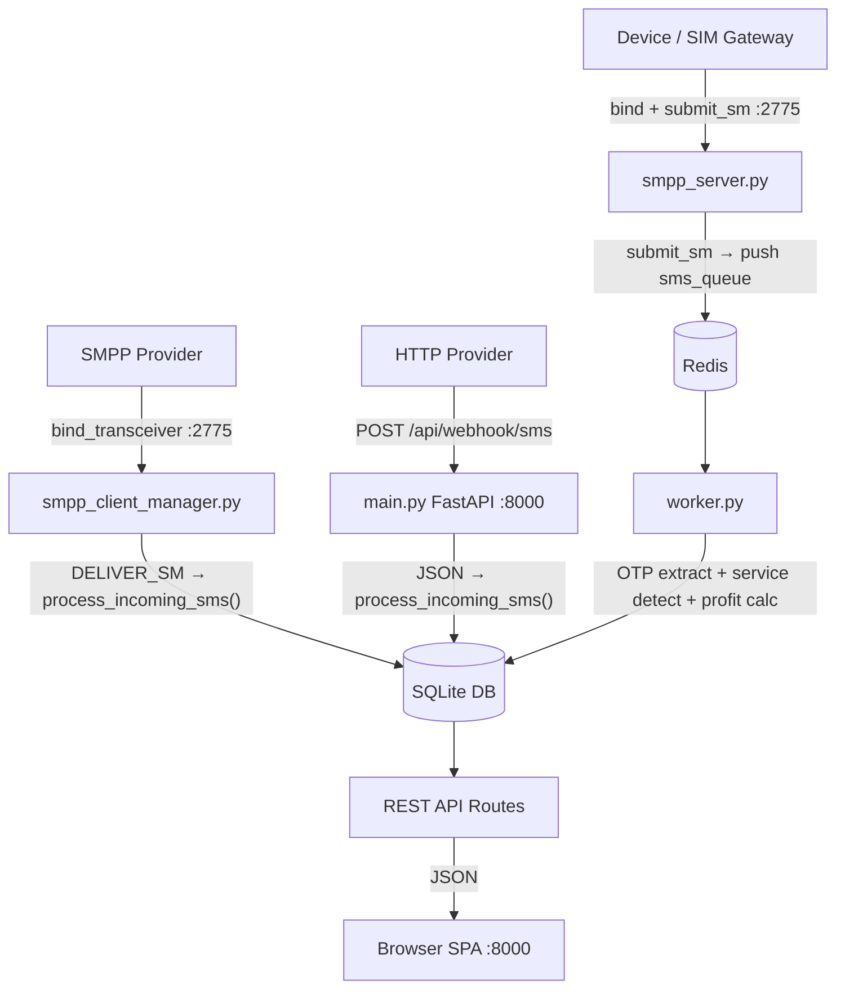
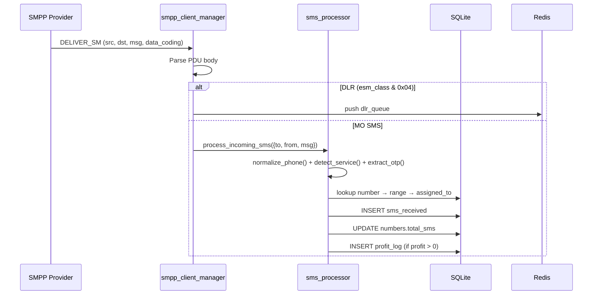
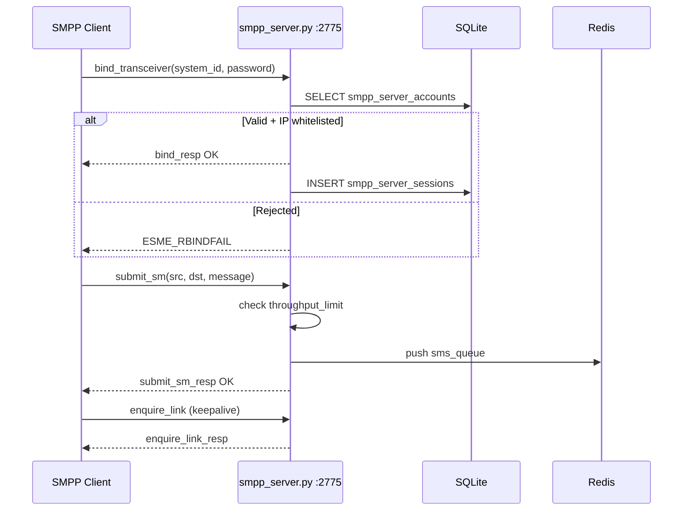
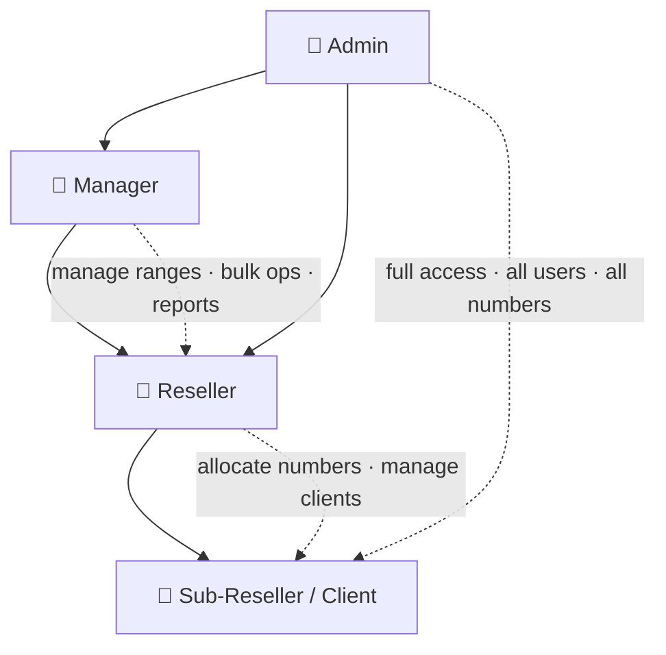

# SIGMAPANEL

Enterprise SMS OTP Management Platform — receives SMS via SMPP and HTTP webhooks, extracts OTPs, manages numbers/ranges/users, and exposes a full REST API with an animated SPA dashboard.

---

## Table of Contents

- [Architecture](#architecture)
- [SMS Receive Flow](#sms-receive-flow)
- [SMPP Server Flow](#smpp-server-inbound-flow)
- [User Hierarchy](#user--role-hierarchy)
- [Repository Structure](#repository-structure)
- [Quick Start](#quick-start--local)
- [Keep Alive After SSH Disconnect](#-keep-alive-after-ssh-disconnect)
- [Docker](#docker)
- [SMPP Setup](#smpp-setup)
- [HTTP Webhook](#http-webhook)
- [API Authentication](#api-authentication)
- [Environment Variables](#environment-variables)

---

## Architecture



---

## SMS Receive Flow



---

## SMPP Server (Inbound) Flow



---

## User / Role Hierarchy



---

## Repository Structure

```
sigmapanel-ci/
│
├── main.py                      # FastAPI app — lifespan, middleware, static file serving
├── database.py                  # SQLite schema (24 tables), migrations, seed data
├── auth.py                      # JWT tokens, bcrypt password hashing, token helpers
├── audit_utils.py               # Central audit log writer used across all routes
│
├── sms_processor.py             # Core SMS business logic — limits, profit, OTP, service
├── otp_extractor.py             # Regex engine to extract OTP codes from message bodies
├── service_detector.py          # Service name detection (sender + CLI + message)
├── service_catalog.py           # 7 500+ service aliases & canonical names
├── country_detector.py          # Phone number → country name/code mapping
├── phone_utils.py               # Phone number normalization (E.164)
├── payout_utils.py              # SMS payout calculation per number/range
│
├── queue_manager.py             # Async Redis queue with in-memory fallback
├── worker.py                    # Background workers: sms_queue + dlr_queue
├── smpp_server.py               # Inbound SMPP server on port 2775
├── smpp_client_manager.py       # Outbound SMPP client — connects to external providers
├── security_middleware.py       # IP firewall, rate limiting, brute-force detection
│
├── routes/
│   ├── deps.py                  # Auth dependency helpers (get_current_user, require_role)
│   ├── auth.py                  # POST /api/auth/login · signup · token
│   ├── webhook.py               # POST /api/webhook/sms|receive — HTTP SMS ingest
│   ├── sms.py                   # GET /api/sms — query, search, analytics, live feed
│   ├── numbers.py               # CRUD /api/numbers — number management
│   ├── numbers_ext.py           # Allocation, bulk import/export, revoke, blacklist
│   ├── ranges.py                # CRUD /api/ranges — SMS range config
│   ├── users.py                 # CRUD /api/users — user & role management
│   ├── dashboard.py             # GET /api/dashboard/stats|analytics|recent-sms
│   ├── settings.py              # GET/POST /api/settings · webhook-info · backup
│   ├── providers.py             # CRUD /api/providers — HTTP + SMPP provider config
│   ├── transactions.py          # Balance ledger, payout requests, balance adjust
│   ├── api_management.py        # API token management (generate, revoke, list)
│   ├── notifications.py         # System notifications, news, support tickets
│   ├── profile_notifications.py # User profile, avatar, password, preferences
│   ├── smpp_interconnect.py     # SMPP accounts, remote servers, sessions, logs
│   ├── security.py              # Security events, blocked IPs, stats
│   └── __init__.py
│
├── static/
│   ├── index.html               # SPA entry point — loads all JS/CSS with cache busting
│   ├── css/
│   │   └── style.css            # Full design system — dark sidebar, glass cards,
│   │                            # animations, badges, responsive layout
│   └── js/
│       ├── ui.js                # UI helpers — modals, toasts, ICONS (7500+ service aliases)
│       ├── api.js               # Authenticated fetch wrapper with token + caching
│       ├── router.js            # Client-side SPA router
│       ├── app.js               # Nav structure, layout render, route wiring
│       ├── auth.js              # Login, signup, session, CAPTCHA
│       ├── dashboard.js         # Dashboard stats, charts (Chart.js)
│       ├── sms.js               # SMS list, search, live OTP feed, analytics
│       ├── numbers.js           # Number management, bulk checkboxes, rate card
│       ├── ranges.js            # Range management UI
│       ├── users.js             # User & role management UI
│       ├── smpp.js              # SMPP server accounts (tabbed: provider/account)
│       ├── smpp_interconnect.js # Remote SMPP server connections + status polling
│       ├── settings.js          # Settings, webhook config, backup, security
│       ├── profile.js           # User profile, avatar upload
│       ├── notifications.js     # Notifications, news, support tickets
│       ├── api_management.js    # API token management UI
│       ├── payouts.js           # Payout requests UI
│       ├── payments.js          # Balance / payments UI
│       ├── security.js          # Security events, IP blocking UI
│       ├── search_access.js     # Number search access UI
│       └── test_panel.js        # Live SMS test panel
│
├── nginx_hardened.conf          # Nginx reverse-proxy config (TLS, rate limits, headers)
├── entrypoint.sh                # Starts all 4 processes: smpp_server, worker,
│                                # smpp_client_manager, uvicorn (foreground)
├── sigmapanel.service           # systemd unit — Restart=always, survives reboot
├── Dockerfile                   # Python 3.11-slim, exposes 8000 + 2775
├── docker-compose.yml           # app + redis:7-alpine, correct REDIS_URL + depends_on
├── requirements.txt             # Pinned Python dependencies
└── README.md                    # This file
```

---

## Quick Start — Local

### Prerequisites

```bash
sudo apt update && sudo apt install -y python3 python3-venv redis-server git
```

### Install

```bash
git clone https://github.com/Adnan5740/sigmapanel-ci.git
cd sigmapanel-ci
python3 -m venv venv
source venv/bin/activate
pip install -r requirements.txt
```

### Start Redis

```bash
sudo systemctl start redis-server
```

### Run

```bash
bash entrypoint.sh
```

| Service | Port |
|---|---|
| Web Dashboard + REST API | `8000` |
| SMPP Server (inbound) | `2775` |

Default credentials: `admin` / `admin123`

---

## ⚠️ Keep Alive After SSH Disconnect

When you close SSH the process dies — it's attached to your terminal.

### Option A — systemd ✅ Recommended

```bash
sudo mkdir -p /var/www/sigmapanel
sudo cp -r . /var/www/sigmapanel
sudo python3 -m venv /var/www/sigmapanel/venv
sudo /var/www/sigmapanel/venv/bin/pip install -r /var/www/sigmapanel/requirements.txt

sudo cp /var/www/sigmapanel/sigmapanel.service /etc/systemd/system/
sudo systemctl daemon-reload
sudo systemctl enable --now sigmapanel

sudo systemctl status sigmapanel
sudo journalctl -u sigmapanel -f     # live logs
```

### Option B — nohup

```bash
nohup bash entrypoint.sh > sigmapanel.log 2>&1 &
echo "PID=$!"
tail -f sigmapanel.log
```

### Option C — tmux

```bash
tmux new-session -d -s sigmapanel 'bash entrypoint.sh'
tmux attach -t sigmapanel   # reattach later
```

---

## Docker

```bash
docker-compose up -d
docker-compose logs -f app
```

Or standalone:

```bash
docker build -t sigmapanel .
docker run -d --name sigmapanel \
  -p 8000:8000 -p 2775:2775 \
  -e REDIS_URL=redis://host.docker.internal:6379/0 \
  -v $(pwd)/data:/app/data \
  sigmapanel
```

---

## SMPP Setup

### Connect to External Provider (outbound)

**SMPP SERVER → SMPP Accounts → Create Account → 📡 Provider Connection**

| Field | Example |
|---|---|
| Host / IP | `smpp.provider.com` |
| Port | `2775` |
| System ID | `my_client_id` |
| Password | `secret` |
| Bind Type | `transceiver` |

### Create Inbound Account (for devices connecting to you)

**SMPP SERVER → SMPP Accounts → Create Account → 👤 Account Setup**

Clients bind to `<your-server-ip>:2775` using the credentials you create.

---

## HTTP Webhook

```
POST http://<your-server-ip>:8000/api/webhook/sms
Content-Type: application/json
```

```json
{
  "to":   "+525529001312",
  "from": "+12025550001",
  "Cli":  "AmericanExpress",
  "msg":  "Your OTP is 847291"
}
```

> `Cli` carries the service/brand name — used for service detection even when `from` is numeric.

Full URL shown in **Settings → Webhook Config**.

---

## API Authentication

```bash
# Get token
curl -X POST http://localhost:8000/api/auth/login \
  -H "Content-Type: application/json" \
  -d '{"username":"admin","password":"admin123"}'

# Use token
curl http://localhost:8000/api/sms \
  -H "Authorization: Bearer <token>"
```

---

## Environment Variables

| Variable | Default | Description |
|---|---|---|
| `DATABASE_URL` | `data/sigmapanel.db` | SQLite file path |
| `REDIS_URL` | `redis://localhost:6379/0` | Redis connection string |
| `PORT` | `8000` | HTTP API listen port |
| `CORS_ORIGINS` | `*` | Allowed CORS origins (comma-separated) |
